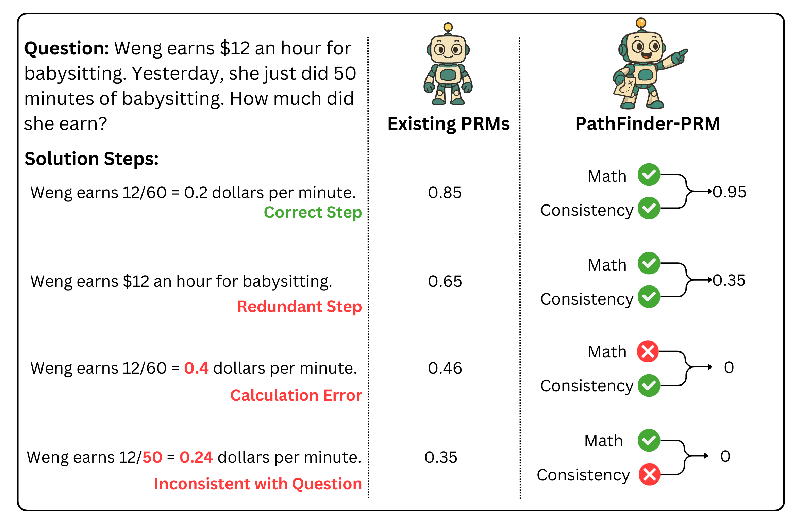

<h1 align="center"> 
PathFinder-PRM
<br/>
</h1>

<!--  -->
<div align="center">


[](https://huggingface.co/declare-lab/PathFinder-PRM-7B) [](https://huggingface.co/datasets/declare-lab/PathFinder-600K) []([http://arxiv.org/abs/2505.](https://arxiv.org/abs/2505.19706))
</div>

This repository contains the official implementation of **Error Typing for Smarter Rewards: Improving Process Reward Models with Error-Aware Hierarchical Supervision**. It is organized into the following three components:

1. **Dataset Generation** (`src/data_generation`): A data augmentation pipeline for automatically annotating PRM800K and RLHFlow Mistral-generated data with 3-dimensional step-level error labels: Math, Consistency, and Optimality.

2. **PRM Training** (`src/training`): Scripts to train a Process Reward Model (PRM) using a hierarchical approach. The model first classifies step-level errors into Math and Consistency categories, followed by estimating step Optimality.

3. **PRM Evaluation** (`src/evaluation`): Scripts to evaluate the trained PRMs on ProcessBench, PRMBench, and Reward-Guided Generation benchmarks, reproducing results reported in the paper.

### Abstract
Large Language Models (LLMs) are prone to hallucination, especially during multi‑hop and reasoning-intensive tasks such as mathematical problem solving. While Outcome Reward Models verify only final answers, Process Reward Models (PRMs) score each intermediate step to steer generation toward coherent solutions. We introduce **PathFinder-PRM**, a novel hierarchical, error‑aware discriminative PRM that first classifies math and consistency errors at each step, then combines these fine‑grained signals to estimate step correctness. To train **PathFinder-PRM**, we construct a 400K‑sample dataset by enriching the human‑annotated PRM800K corpus and RLHFlow Mistral traces with three‑dimensional step‑level labels. On PRMBench, **PathFinder-PRM** achieves a new state‑of‑the‑art PRMScore of 67.7, outperforming the prior best (65.5) while using 3× less data. When applied to reward guided greedy search, our model yields prm@8 48.3, a +1.5 point gain over the strongest baseline. These results demonstrate that decoupled error detection and reward estimation not only boost fine‑grained error detection but also substantially improve end‑to‑end, reward‑guided mathematical reasoning with greater data efficiency.



## Getting Started
```bash
# create a conda environment
conda create -n pathfinder python=3.10.16
conda activate pathfinder

# install required packages
pip install -r requirements.txt
pip install flash-attn --no-build-isolation
```

Refer to the following for how to proceed with each part of the project:

* [Dataset Generation](src/data_generation/README.md)
* [PRM Training](src/training/README.md)
* [PRM Evaluation](src/evaluation/README.md)

## Citation
```
@misc{pala2025errortypingsmarterrewards,
      title={Error Typing for Smarter Rewards: Improving Process Reward Models with Error-Aware Hierarchical Supervision}, 
      author={Tej Deep Pala and Panshul Sharma and Amir Zadeh and Chuan Li and Soujanya Poria},
      year={2025},
      eprint={2505.19706},
      archivePrefix={arXiv},
      primaryClass={cs.CL},
      url={https://arxiv.org/abs/2505.19706}, 
}
```
